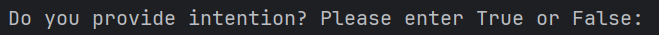
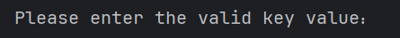
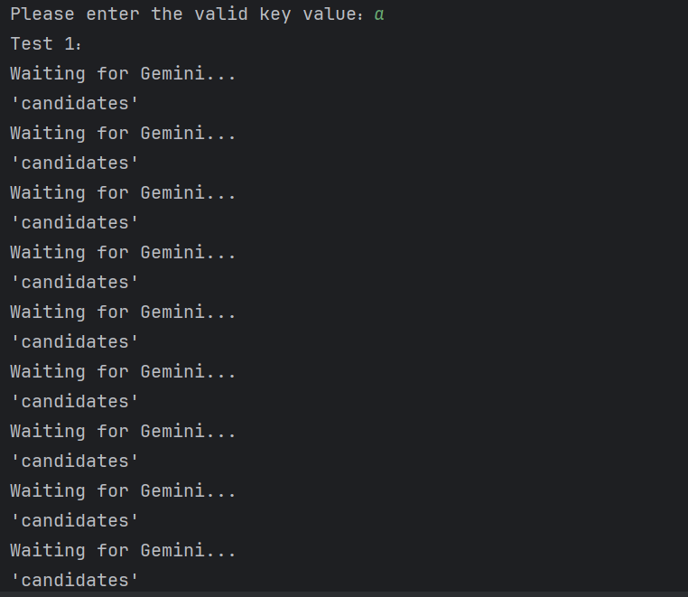

# Differential Prompting

## Demo

https://github.com/differential-prompting/dfprompting/assets/132351025/e965ea62-2b30-4419-8d1e-cb316d7a005d

## Description

Differential Prompting is an approach that can effectively find failure-inducing test cases with the help of the compliable code synthesized by the problem description or the inferred intention by Gemini. This command line tool allows users to interact with Gemini to automatically generate code, and test input pools.

## Installation

1. Clone or download our code to your local machine:

   ```bash
   git clone https://github.com/differential-prompting/dfprompting.git
   ```

2. Install the required packages:

   ```bash
   pip install -r requirements.txt
   ```

## Usage

To use the command line tool, run the following command:

```bash
cd main
```

```bash
python DP.py
```
Firstly, you need to choose whether to provide intention for the program or not:



If you choose True, you need provide intention for the program and save it in the file of main/intention.txt, if False, the Gemini can automatically generate intention for the program you providing.

Next, you need enter the valid key value for accessing Gemini:



If your key value is invalid, you can not get the right result as follows:



Once the command is executed, the results will be saved in the `results.xlsx` file.

